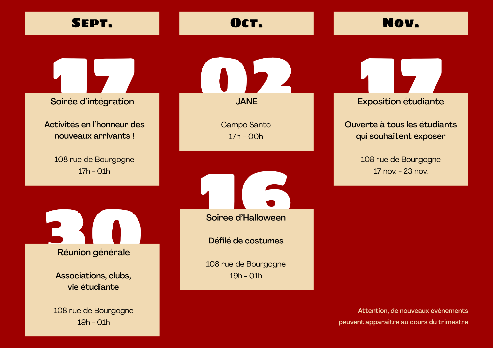

# Bureau des étudiants de l'ESAD Orléans
<!-- ATTENTION : le fichier planning doit être nommé    planning.png   et placé dans le dossier assets > images > planning -->
<!--ATTENTION : Il ne peut y avoir QU'UN SEUL fichier dans planning.png-->

  

  <h2 class="section-title__item">Évènements à venir</h2>
  




  
  

    <h3>{{ event.titre }}</h3>
    
<strong>Date :</strong> {{ event.date | date: "%d/%m/%Y" }}

    
<strong>Heure :</strong> {{ event.heure }}

    
<strong>Lieu :</strong> {{ event.lieu }}

    <a href="{{ event.url | relative_url }}">Voir les détails</a>
  



  

  <h2 class="section-title__item">Évènements passés</h2>
  




  <h3>{{ event.titre }}</h3>
  
<strong>Date :</strong> {{ event.date | date: "%d/%m/%Y" }}

  
<strong>Lieu :</strong> {{ event.lieu }}

  <a href="{{ event.url | relative_url }}">Voir l'archive</a>


